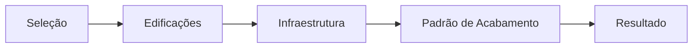

# Documentação Método Construtor  

# Histórico de revisões

| Data           |Versão          |Descrição          |Autor	       |
|----------------|----------------|------------------ |----------------|
|`08/04/2020`    |`'1.0'`         |`Documento Inicial`|`Diego Augusto` |

# Introdução

Está documentação tem como objetivo, explicar o  projeto, mostrar o seu funcionamento e auxiliar quem estiver dando manutenção/lendo no/o código.
O objetivo desse sistema é dar poder de compra ao cliente, facilitando o processo orçamentário de uma obra.

# Visão Geral

O sistema foi desenvolvido na linguagem Javascript com a biblioteca REACT.JS, o sistema tem 5 componentes,  TipoDeServico.js, Edificacoes.js, Infraestrutura.js, PadraoAcabamento.js e Resultado.js. Cada uma dessas fases representa uma etapa de obra e seus seguimentos. O sistema funciona em torno dessas 5 telas na qual o usuário escolherá qual o tipo de obra ele quer orçar, quais componentes a obra possuirá e verificar se o valor total está de acordo com o orçamento previsto. Em caso de inconformidades, o usuário poderá voltar nas páginas e reorganizar as opções, desmarcando  itens e escolhendo outros mais caros ou mais baratos. Esse processo torna o orçamento de obras mais fácil de ser realizado.

# Requisitos não-funcionais

| Interoperabilidade         |Deve ser desenvolvido na linguagem Javascript, com a Lib REACT.JS       |	    
|---------------|----------------|

# Mecanismos arquiteturais
### AVISO PRÉVIO
Este trecho será mais esclarecedor caso você tenha o código aberto, pois ele segue o fluxo do código e por conseguinte de cada função.

## Funções

### componentDidMount()
Ela é acionada toda a vez que a página é carregada, e aciona duas funções, pegarLista() e gerarTotal()

### mudarFoto()
ela altera a foto de fundo, das telas edificações, infraestrutura e padrão acabamento.

-- A função possui 3 variáveis, que são:

- **"Elemento"**, que resgata o elemento pelo id que passamos como parâmetro para a função. Esse id é colocado na div, que queremos utilizar como gatilho, para quando passarmos o mouse em cima dela, ela acione a função.

- **"imagemTrans"**, que resgata a imagem pela classe "imagem-transitoria", que é a variável que possibilita mudar a imagem pelas classes.

- **"imagemPadrao"**, que resgata a imagem padrão a sempre estar na página, quando não for alterada, ela resgata a imagem que foi importada no cabeçalho do arquivo.

E possui dois **addEventListener** que são as **funcionalidades principais** da função:

- A **"mouseover"** ela altera o background, adicionando um novo, com a imagem que desejamos. Então quando colocamos o cursor do mouse, na div que decidimos ser o gatilho pra função, ela altera a imagem de fundo, para a imagem que passamos como parâmetro.
 
- A **"mouseout"** ela altera o background para o **background padrão** quando tiramos o mouse de cima da div que usamos como gatilho para a função.

### pegarNames()
Tem como funcionalidade resgatar os **names** dos inputs.
Possui três variáveis, que são arrays:
- lista, que nós utilizamos pra resgatar o input e futuramente pra saber se é um radio ou checkbox.
- listaNames que utilizamos pra salvar os names dos inputs que vem dentro do array lista.
- listaSet que utilizamos pra receber o listaNames só que filtrado.

Depois de fazer esse processo de filtragem, retornamos o array filtrado com os names (return listaSet)

### pegarLista()
Ele armazena a lista filtrada de names dentro da variável **listaSet**, pra armazenar dentro do state **"itens"** e chama a função **checkItens()** passando como argumento da função a **listaSet**.

### resetAll()
A função serve parar reiniciar todos os dados da página, para o usuário começar novamente.
Ele armazena a lista filtrada de names dentro da variável **lista**.
Armazena uma lista de  **"radios"** e resgata dentro do array, transformando em um objeto
Depois remove os valores do state, que são as variáveis "somaX" (cada pagina possui a sua própria) e itensInputs, colocando o valor zero
utiliza o array radio, para mapear todos os **radios** que estão **checked** e receber **"false"** para desmarcar o rádio.
Mapeia todos os names dentro da lista e remove esses itens do sessionStorage 

### checkItens()
A função serve para marcar(selecionar) os inputs.

Ela possui três variáveis:  
- checkedIds que é um array vazio,
- sum que inicia como zero,
- auxItem que serve como auxiliar.

primeiro ela mapeia os names dentro do array names que recebemos como parâmetro da função, e armazena todos os itens do sessionStorage que possuem o mesmo name, dentro da auxItem, e realiza uma verificação pra saber se são diferentes de null, e insere dentro da checkedIds os valores.
Em seguida mapeia a checkedIds passando item e i(index) como parâmetro, realiza uma verificação pra saber se a item está vindo vazio ou null e marca os inputs. E adiciona os valores dentro da sum, para gerar a soma dos itens.
Depois adiciona o valor sum(que é a soma dos itens selecionados) dentro do state somaX(cada página possui o seu).
E no final adiciona o state da somaX dentro da sessionStorage e realiza a chamada da função fillItens()

### fillItens()
A função serve para filtrar os itens
Ela possui três variáveis:
- itens : que recebe o state da itens,
- values : que inicia como um array vazio,
- itensValues : que recebe o state da itensInputs.

Mapeamos cada item da itens resgatando do sessionStorage e salvando na variável item, depois realiza uma verificação pra saber se está vindo diferente de null.
Dentro desta verificação, é realizado uma expressão regular na itens, depois transformamos em inteiro e adicionamos o valor da itens dentro da variável values.

E por fim, mapeamos a value para resgatar o valor e salvar dentro da itensValues em posições e colocamos esse array itensValues dentro do state da itensInputs.
 

### salvarDadosLocal()
A função serve para salvar os dados no sessionStorage e gerar o total.
Ela possui três variáveis:
- total : tornamos inteiro o item total do sessionStorage e armazenamos esse valor dentro da variável total.
- newSomaEd : recebe o state da somaX
- somaX : tornamos inteiro o item edificacoes ou infraestrutura ou padraoacabamento (depende de qual página estamos utilizando) e armazenamos esse valor dentro da variável somaX;

resgatamos o state da somaX e armazenamos ela no sessionStorage no item edificacoes ou infraestrutura ou padraoacabamento (depende de qual página estamos utilizando) 

É realizado uma verificação se o total é igual a zero, se for, nós adicionamos o valor da variável newSomaEd dentro da variável total, caso não seja nós retiramos da variável total o valor da variável somaEd e adicionamos o valor da variável newSomaEd.

Por fim acionamos a função gerarTotal() e enviamos o usuário para a próxima página.

### gerarTotal()
A função serve para gerar o **orçamento final** da soma de todas as páginas.

Ela utiliza uma variável que é a soma, e com ela resgatamos os itens edificacoes, infraestrutura e padraoacabamento do sessionStorage e itera os valores dentro da variável soma. Isso gera o orçamento total, então adicionamos o valor da variável soma dentro do item total da sessionStorage.

### mudarItem()
A função serve para **marcar os itens**.
Ela possui cinco variáveis:
- value: serve para resgatar o valor inteiro do input.
- resultado: serve parar resgatar o state da somaX da página.
- stateItens: serve para resgatar o valor do state do itensInputs
- itemArray: serve para armazenar itens dentro de um array.
- valorItem: serve para armazenar os valores dos itens.

Armazena o **name** do sessionStorage do **"e"**, que é passado no parâmetro da função dentro do **itemArray**.
Resgata a variável **resultados** e retira o valor dela de acordo com o resultado da função somarItem passando como parâmetro o itemArray.

Realiza uma verificação pra saber se o input está selecionado (**checked**)
- verifica se o name que está sendo resgatado do sessionStorage é null ou se o tipo do input que estamos lidando (e.target.type) é um **"radio"**, caso seja **true**, ele chama a função deleteItem e remove do array stateItens na posição do id o id daquele item, caso seja **false**, ele resgata o itemArray e salva o name dos inputs do sessionStorage. E em seguida envia o **valor** para dentro do array itemArray.

Caso a verificação seja false (**ou seja ela não foi selecionada**)
Resgata o itemArray e salva o name dos inputs do sessionStorage. E realiza a chamada da função **deleteItem** passando como argumento o itemArray e o e.target.id, para deletar o id dentro do itemArray.

Setamos dentro do **sessionStorage** os item com o **name** passando o objeto dentro do itemArray.

Salvamos dentro do itemArray o name que salvamos dentro do sessionStorage.

Armazenamos dentro da variável valorItem o valor da chamada da função somaritem passando como argumento o itemArray;

E somamos o valorItem dentro da **resultado**.

stateItens na posição do id recebe a variável valoritem;
E depois setamos o stateItens dentro do state do itensInputs e setamos o resultado dentro do state da **somaX**(Ex: somaEdificacoes).

### resetarStorage():
Resgata as variáveis do sessionStorage e remove **todos os dados**, para reiniciar o sistema, e te envia para a página inicial.

### deleteItem():
A função serve para **deletar os itens** dentro do array.

Ela utiliza uma variável que é a index, que inicia com valor zero.

Realiza a verificação, se o itemArray que está no parâmetro da função é diferente de null, depois verifica se o tamanho do array é maior ou igual a 1, então ele filtra a itemArray buscando os index de cada item e retornando o id, para só então remover do itemArray os índices.

### somarItem():
A função serve para **somar os itens** dentro do array

Ela utiliza uma variável que é a aux, que inicia com valor zero. 
Verifica se o itemArray é diferente de null, depois verifica se o tamanho do array é maior ou igual a 1, então utiliza a aux para armazenar o itemArray com um reduce que serve para somar o totalItem, que é uma variável que utilizamos dentro do reduce, para iterar o valor.value.

## Fluxo de páginas

O sistema possuí 5 páginas:
- Página de seleção, aonde o usuário escolhe qual tipo de projeto ele irá orçar
- Página de Edificações, você realiza o orçamento da sua obra, clicando em itens referente a edificações
- Página de Infraestrutura, você realiza o orçamento da sua obra, clicando em itens referente a edificações
- Página de Padrão de Acabamento, você realiza o orçamento da sua obra, clicando em itens referente a edificações
- Resultado final, onde mostra, o resultado da soma das páginas anteriores (o orçamento da junção das três páginas)

## Fluxo do sistema
O funcionamento do sistema gira em torno de três telas principais:

- Edificações
- Infraestrutura
- Padrão de Acabamento

Elas possuem o mesmo fluxo, existem variáveis que são iniciadas ao entrar na tela que são salvas no localStorage e variáveis que são utilizadas apenas no React.js, utilizando o recurso de state, que possibilita você alterar o seu valor, durante a função, removendo e adicionando dados.

a tela é dividida em três principais partes: 
- **planilha de dados**, que são os itens a serem selecionados, com seus valores e nomes,
-  **resumo**, é um menu lateral onde mostra os valores, dos itens selecionados
-  **rodapé**, onde fica a transição de páginas, o resultado e a barra de progresso de páginas 

Dentro de **planilha de dados**, ao clicar nos itens o sistema resgata a **posição do array**, o **name** e o **value**. 

- A posição do array serve para identificarmos qual componente estamos manipulando e salvando os dados, e para usarmos uma função que sirva parar todos os itens, ao invés de criar uma função para cada item. 
- O name, serve para identificarmos qual item estamos lidando, dentro da planilha.
- O value serve para obtermos o valor daquele item, para realizarmos o cálculo

No **Resumo**,  nós mostramos ao usuário o valor dos itens selecionados, através da posição do array dentro do state do itensInputs.
- O itensInputs é um array que utilizamos dentro do state do React

E no **Rodapé**, utilizamos um sistema de prosseguir e retornar, o total da página e a barra de progresso.

- O sistema de prosseguir e voltar, é um sistema que salva os dados da página (itens selecionados e total da página) para que, quando você ir para outra página, os inputs que foram marcados, não percam os seus valores, ao retornar a página, e o total, não seja alterado, caso você mude de página

- O total, é o resultado da soma, de todos os itens selecionados dentro da página. Todos os itens possuem um value, mesmo que seja 0, e o total, é a soma deles.

- E a barra de progresso, mostra quanto falta para a página final, que mostra a página de resultado

# Fundamentação

nesta fase, o arquiteto deve fundamentar todas as decisões importantes de design. Além disso, deve descrever as alternativas significativas rejeitadas no projeto. Esta seção pode indicar hipóteses, restrições, resultados de análises e experiências significativas para a arquitetura.

# Visão de casos de uso

esta fase, será responsável por apresentar os casos de uso ou cenários escolhidos para a validação da arquitetura apresentada. Casos de uso, backlog, requisitos de usuários ou qualquer outro nome que represente os itens relevantes para o funcionamento do sistema final, o intuito é exercitar e testar os principais aspectos de risco da arquitetura.

# Componentes
### Diretórios
nesta fase, o arquiteto deve apresentar o diagrama de componentes. É recomendado como boas praticas de mercado o uso do modelo UML para criação do diagrama, que deve apresentar os possíveis componentes e suas dependências. Além disso, o arquiteto deve criar uma tabela detalhando as responsabilidades de cada componente.

/construtor-virtual : pasta raiz do sistema
/node_modules : pasta onde é salvo as bibliotecas que o sistema utiliza
/public : pasta onde se encontra sua index.html 
/src : pasta principal do sistema
/src/App.js : arquivo que renderiza as páginas desenvolvidas e envia pra index
/src/Index.js : index do sistema em js, onde ficam as rotas para cada componente (página ou função)
/src/Assets : pasta onde se localiza as imagens e icones do sistema
/src/components/ : pasta onde se localiza os componentes (páginas ou funções) do sistema
/src/css : pasta onde se localiza a estilização do sistema
/src/Utils : pasta onde se localiza as utilidades do sistema, como por exemplo fontes
/wire-frames : pasta onde se localiza as wireframes do sistema 

# Implantação
### Como acessar o sistema

O software é disponibilizado de forma online, acessando o link: 
- https://metodo-construtor-virtual.herokuapp.com

### Como iniciar o projeto
### Mas para inicia-lo na sua máquina, você necessita de alguns requisitos:
- repositório github do sistema
- ferramenta de versionamento "Git"
- Node.js

Ao resgatar o link do repositório, abra o seu terminando cmd dentro de uma pasta de sua preferencia, e digite:
- git init
- git remote add origin  "link do repositório"
- git pull

Agora o repositório já esta no seu computador, abra a pasta no caminho:
/construtor-virtual
abra o cmd, digite :
- npm install (instala as bibliotecas que o sistema necessita no seu dispositivo)

Assim que terminar de instalar as dependências, digite,
- npm start (inicia o projeto)

O navegador irá abrir o sistema

# Conclusão

O projeto foi desenvolvido dentro da método com o intuito de facilitar a geração de orçamento das obras e concluímos que a melhor forma de auxiliar o usuário é dar várias maneiras de ações que ele possa tomar, sempre mostrando o resultado e de maneira rápida. 
